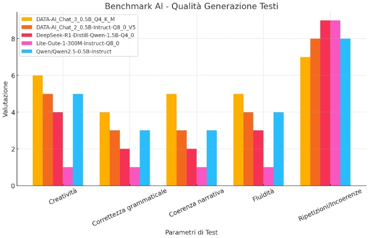

# M.INC. - Innovazione e Intelligenza Artificiale  

Benvenuto nel repository ufficiale di **M.INC.**, azienda leader nella ricerca e sviluppo di tecnologie avanzate basate sull'**Intelligenza Artificiale**.  

## 📌 Chi siamo  
M.INC. è un'azienda specializzata nello sviluppo di **modelli di AI avanzati** con un focus sulla generazione di testi di alta qualità. La nostra missione è creare modelli che offrano un equilibrio tra **creatività, precisione e coerenza narrativa**, superando le limitazioni delle attuali soluzioni sul mercato.  

Il nostro team di **ricercatori e ingegneri** lavora costantemente per migliorare la qualità della generazione testuale, ridurre le ripetizioni e garantire una fluidità sempre più naturale nelle risposte.  

---

## 🚀 Progetto Attuale: DATA-AI Chat 3  
Il nostro modello più recente, **DATA-AI_Chat_3_0.5B_Q4_K_M**, è il frutto di anni di ricerca e sviluppo. Si tratta della terza iterazione della nostra serie di modelli AI, con miglioramenti significativi rispetto alle versioni precedenti.  

### 🔍 **Caratteristiche principali**  
✔ **Migliorata la creatività** per testi più originali e dinamici.  
✔ **Maggiore correttezza grammaticale** grazie a un raffinato training dataset.  
✔ **Coerenza narrativa ottimizzata** per conversazioni più fluide e logiche.  
✔ **Riduzione delle ripetizioni** per generazioni di testo più pulite e coerenti.  
✔ **Supporto multi-formato**, con versioni compatibili per diverse piattaforme AI.  

### 📊 **Benchmark & Prestazioni**  
Abbiamo condotto un'analisi comparativa del nostro modello rispetto a diverse alternative sul mercato, valutando le prestazioni secondo questi parametri:  

- **Creatività** 🎨  
- **Correttezza grammaticale** ✍️  
- **Coerenza narrativa** 📖  
- **Fluidità** 🌊  
- **Riduzione delle ripetizioni** 🔄
  
]

]
I risultati hanno dimostrato che **DATA-AI_Chat_3_0.5B_Q4_K_M** si distingue per la sua capacità di generare testi più creativi e coerenti rispetto ai competitor.  

---

## 📥 **Download & Installazione**  
Il modello **DATA-AI_Chat_3_0.5B** è disponibile in più formati per garantire massima compatibilità:  

📌 **HuggingFace (FP16, per GPU e CPU ad alte prestazioni)**  
🔗 [Mattimax/DATA-AI_Chat_3_0.5B](https://huggingface.co/Mattimax/DATA-AI_Chat_3_0.5B)  

📌 **HuggingFace (GGUF, ottimizzato per inferenza su CPU con llama.cpp/KoboldCpp)**  
🔗 [Mattimax/DATA-AI_Chat_3_0.5B-GGUF](https://huggingface.co/Mattimax/DATA-AI_Chat_3_0.5B-GGUF)  

📌 **Ollama (per installazione e inferenza locale semplificata)**  
🔗 [DATA-AI_3_0.5B su Ollama](https://www.ollama.com/M_INC/DATA-AI_3_0.5B)  

### ▶ **Esempio di utilizzo con Ollama**  
Dopo aver installato [Ollama](https://ollama.ai/), eseguire:  
```bash
ollama run M_INC/DATA-AI_3_0.5B
```
oppure (per il modello da 1.5B):
```bash
ollama run M_INC/DATA-AI_3_1.5B
